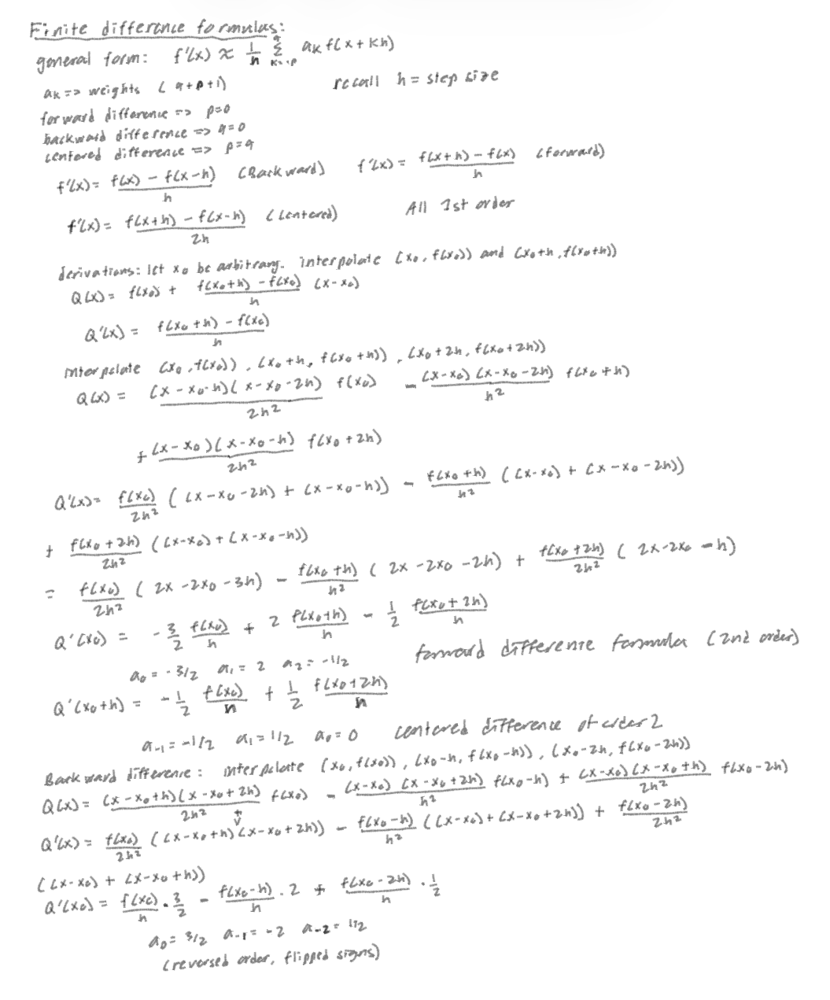

# ODE-solver
There are a number of ways to exactly solve a first order differential equation. To numerically solve a first order DE of the form u'=f(u,t), we require some numerical methods. Let's start with the Euler method. We are given an initial condition, u(t_0). We want to know what u(t) is, at some unspecified time t. Let t_0=a and t_n=b, where t_n=t. We can partition the interval [a,b] into n+1 equally spaced nodes, t_0, t_1,....,t_n. This is simple, given a step size h, h= (b-a)/n, then t_i = t_0 + i(h) for i=1,2,...n. Given a forward difference approximation of u' at t_i, $u'(t_i)= \frac{u(t_{i+1}) - u(t_i)}{h}$ for i=0,1,...n-1. This equation can be rearranged to be $$u(t_{i+1})= u(t_i) + (h)u'(t_i)$$ for i=0,1,...,n-1. This is Euler's method. Notice that for i=0, we already have the value of u(t_i), and the differential equation is also given. Thus we can compute u(t_1), and from that we can compute u(t_2), and so on, until we get to u(t_n). To discuss accuracy, we must understand the nature of the problem. u(t_0) is an exact value, since it is our initial condition. But u(t_1) is an approximation, since we are approximating the derivative u'(t_0) with a forward difference formula. in fact, for all i>/= 1, we are approximating t_i, with the errors compounding additively. The truncation error, denoted $$Tau_{i+1}(h)$$, is the error between the exact derivative, $$f(u(t_i), t_i)$$, and the FD approximation. The pointwise error is the difference between the exact value, $$\hat{u}_{i+1}$$, and the approximation to it, assuming that u_i is also exact. In the image, we prove that the pointwise error is O(h^2) and the truncation error is O(h). 
Runge-Kutta is a more accurate method, as we will see. It involves taking multiple evaluations across the time step of length h. The improved Euler method is a simple example of this. Instead of using $f(u_i,t_i)$ as the derivative, we use $f(u_i+(h/2)f(u_i,t_i), t_i + h/2)$. 

# diffrentiation

# integration 

